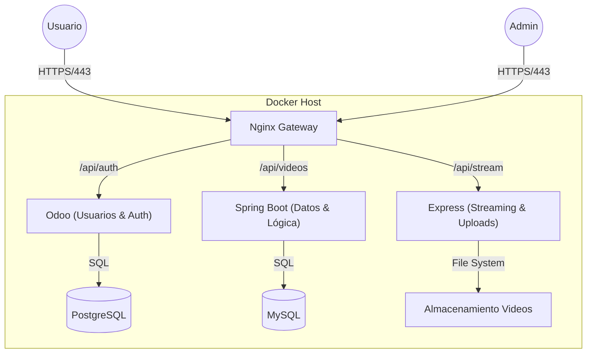
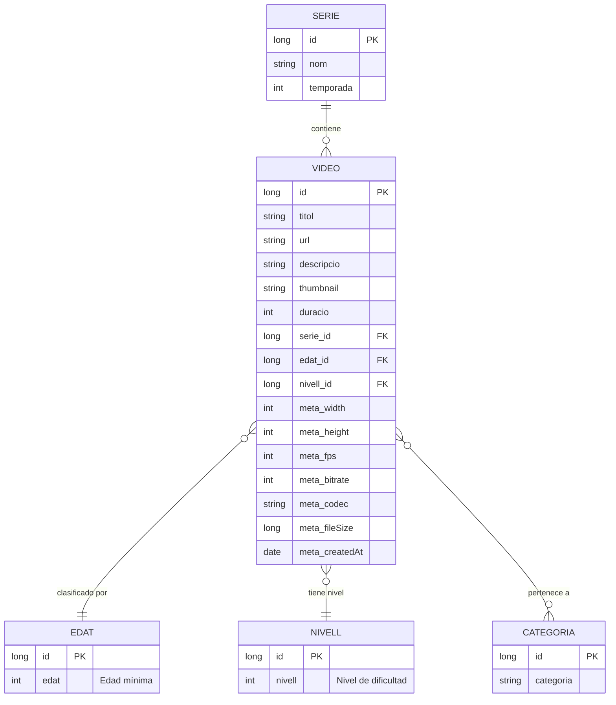
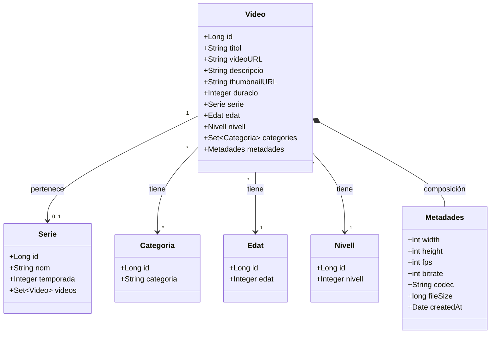
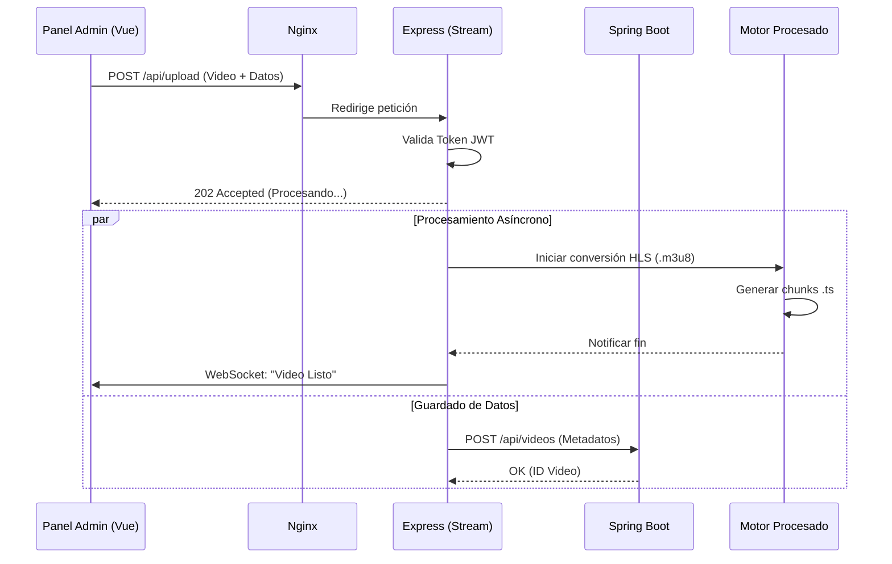
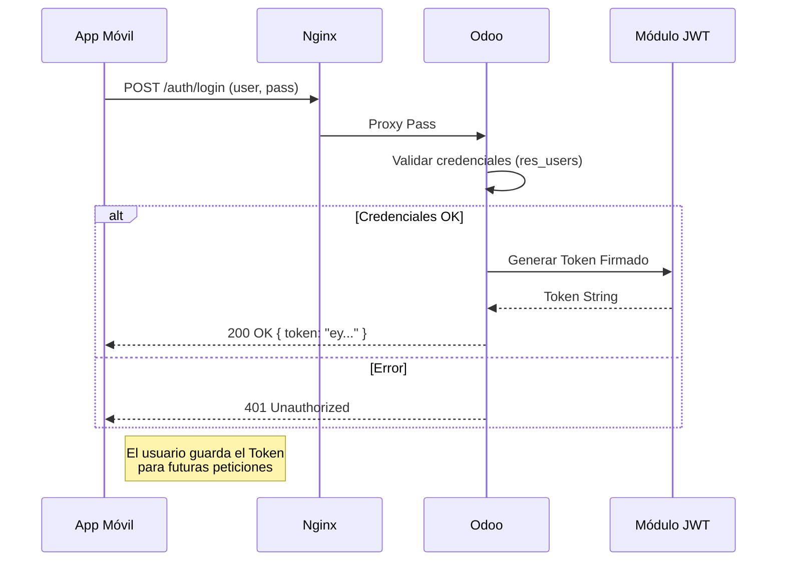

# 🎬 JustFlix - Plataforma de Streaming

Bienvenido a **JustFlix**, una plataforma completa de streaming de video diseñada con una arquitectura de microservicios moderna. Este proyecto integra múltiples tecnologías para ofrecer una experiencia robusta tanto para usuarios finales (App Móvil) como para administradores (Web Admin).

---

## 🏗️ Arquitectura del Sistema

El sistema utiliza una arquitectura de **Microservicios** orquestada con **Docker Compose**. Un servidor **Nginx** actúa como puerta de entrada (Reverse Proxy), distribuyendo el tráfico a los distintos servicios backend según la petición.



### 🧩 Componentes Principales

| Componente         | Tecnología       | Responsabilidad                                         | Puerto Interno |
| :----------------- | :--------------- | :------------------------------------------------------ | :------------- |
| **Gateway**        | Nginx            | Proxy Inverso, SSL/TLS, Enrutamiento.                   | 80 / 443       |
| **Auth Service**   | Odoo 16          | Gestión de Usuarios, Suscripciones y Autenticación JWT. | 8069           |
| **Data Service**   | Spring Boot      | API REST para Metadatos de Videos, Series, Categorías.  | 8081           |
| **Stream Service** | Express + FFmpeg | Procesamiento de Video (HLS), Subidas, WebSockets.      | 3000           |
| **Admin Web**      | Vue.js 3         | Panel de Administración para gestionar contenido.       | Cliente        |
| **Mobile App**     | Flutter          | Aplicación para usuarios finales (iOS/Android).         | Cliente        |

---

## 🚀 Guía de Inicio Rápido

### Prerrequisitos

- **Docker** y **Docker Compose**.
- **Node.js** (para ejecutar el cliente web localmente).
- **Flutter SDK** (para ejecutar la app móvil).

### 🛠️ Instalación y Despliegue

1.  **Clonar el Repositorio**:

    ```bash
    git clone <url-del-repo>
    cd ProjecteIntermodular
    ```

2.  **Generar Certificados y Claves**:
    El proyecto necesita claves para JWT y SSL. Asegúrate de tener `public_key.pem` en la raíz (ver instrucciones detalladas en los servicios).

3.  **Iniciar los Servicios**:

    ```bash
    docker-compose up -d --build
    ```

    _Esto levantará MySQL, PostgreSQL, Odoo, Spring Boot, Express y Nginx._

4.  **Acceder a los Servicios**:

    | Servicio         | URL Local (vía Nginx)                            |
    | :--------------- | :----------------------------------------------- |
    | **Odoo (ERP)**   | `https://localhost:8069`                         |
    | **Admin Panel**  | `http://localhost:5173` (Requiere `npm run dev`) |
    | **API Spring**   | `https://localhost/api/...`                      |
    | **Video Stream** | `https://localhost/videos/...`                   |

---

## 📊 Diagramas de Arquitectura

### 1. Diagrama de Entidad-Relación (Datos de Contenido)

Modelo lógico de la base de datos de contenidos (gestionada por Spring Boot).



### 2. Diagrama de Clases (Spring Boot Core)

Estructura de las clases principales del servicio de datos.



### 3. Diagrama de Secuencia: Subida de Video

Flujo desde que el admin sube un video hasta que está listo para streaming.



### 4. Diagrama de Secuencia: Login de Usuario

Cómo se autentica un usuario móvil usando Odoo.



---

## 📚 Documentación Detallada de Servicios

Para profundizar en cada componente, consulta sus propios READMEs:

- **Backend Datos**: [Spring Boot Documentation](./Sprint_3/Services/springboot/README.md)
- **Streaming Server**: [Express Documentation](./Sprint_3/Services/Express/README.md)
- **Auth & ERP**: [Odoo Documentation](./Sprint_3/Services/Odoo/README.md)
- **Gateway**: [Nginx Documentation](./Sprint_3/Services/Nginx/README.md)
- **Client Web**: [Admin Web Documentation](./Sprint_3/Clients/admin-web/README.md)
- **Client Mobile**: [App Móvil Documentation](./Sprint_3/Clients/appMovil/README.md)

---

## 🛠️ Stack Tecnológico

| Área                | Tecnología                | Versión  |
| :------------------ | :------------------------ | :------- |
| **Backend 1**       | Java Spring Boot          | 3.x      |
| **Backend 2**       | Node.js Express           | 18+      |
| **ERP**             | Odoo                      | 16       |
| **Frontend Web**    | Vue.js                    | 3 (Vite) |
| **Frontend Mobile** | Flutter                   | 3.x      |
| **Base de Datos**   | MySQL 8.0 & PostgreSQL 15 | -        |
| **Infraestructura** | Docker Compose            | -        |

---

_Proyecto desarrollado para el Sprint 3 - Integración Intermodular._
