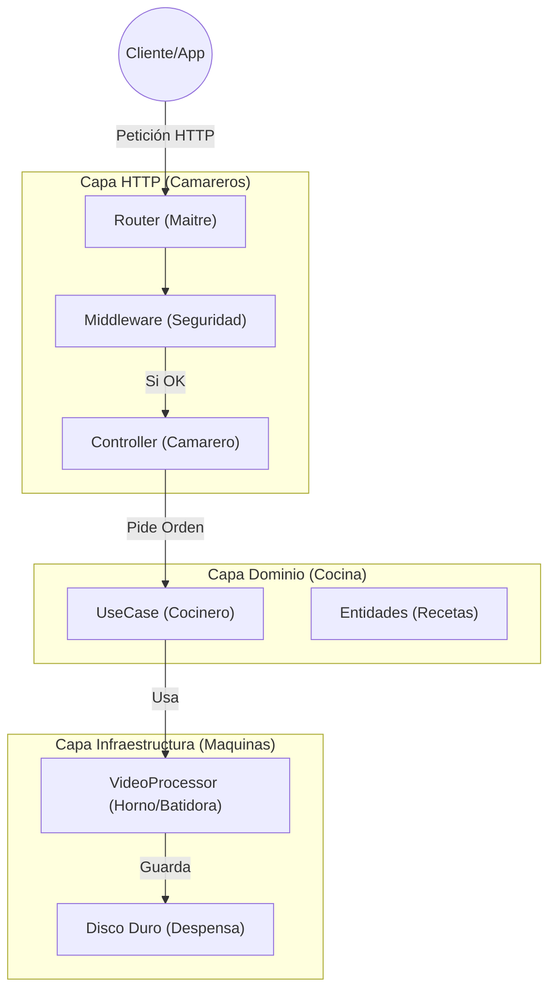
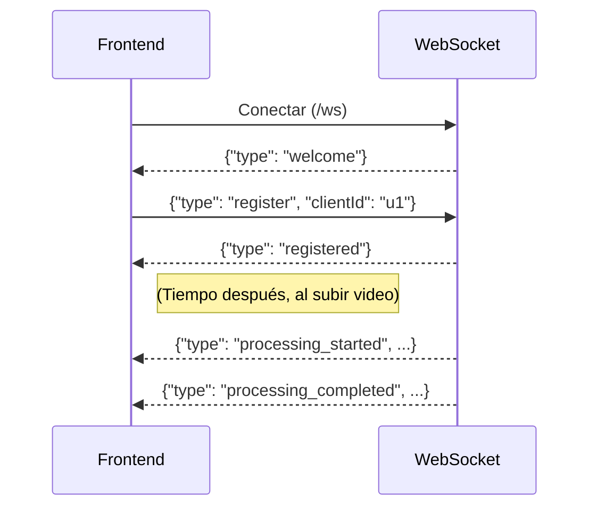
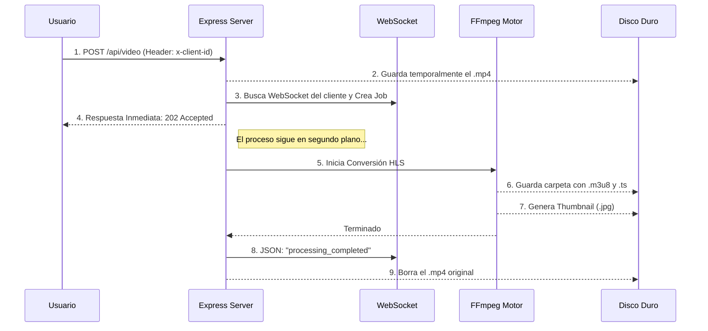
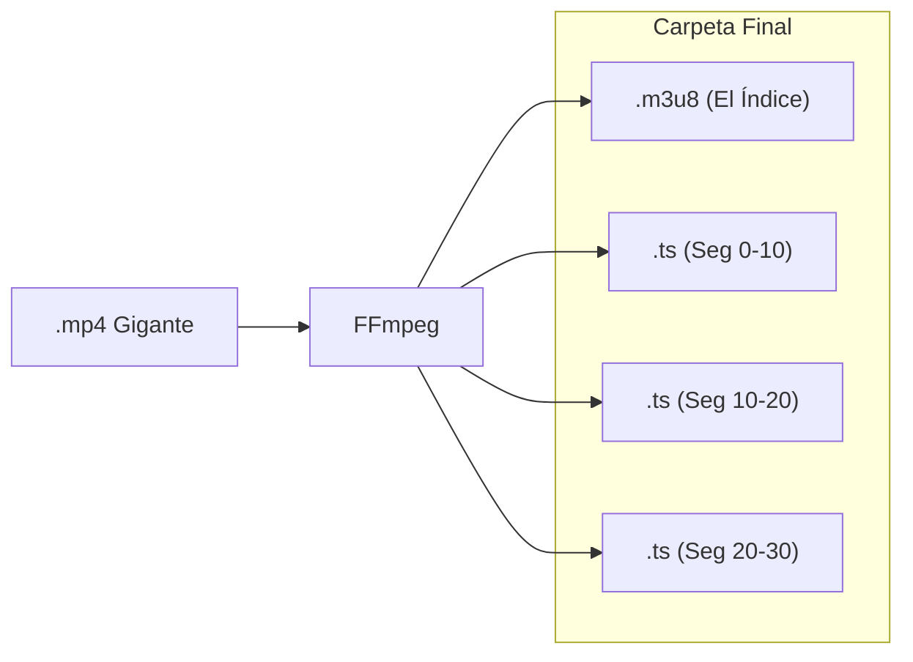
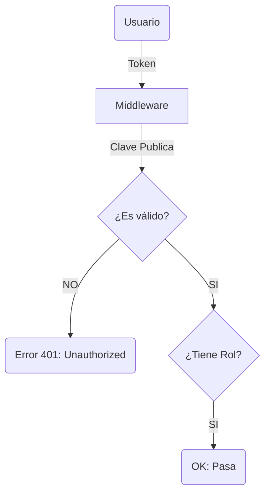

# 🦄 Manual de Desarrollo: Servidor de Streaming JustFlix

¡Bienvenido! Estás ante el motor de **JustFlix**, nuestra plataforma de streaming.
Este documento es tu guía definitiva. Está pensado para que, aunque sea tu primer día (o tu primer servidor serio), entiendas **todo** lo que ocurre aquí dentro sin frustrarte.

---

## 🗺️ Mapa Visual de la Arquitectura

Este servidor no es un plato de espaguetis 🍝. Está ordenado por capas (Clean Architecture).
Imagina que el servidor es un restaurante.

> *Nota: Si no ves los diagramas, asegúrate de usar un visor compatible con Mermaid o la extensión "Markdown Preview Mermaid Support" en VSCode.*

1. **HTTP (Entrada)**: Recibe el pedido.
2. **Dominio (Lógica)**: Decide qué hacer (ej: "Hay que procesar este video con calidad HD").
3. **Infraestructura (Herramientas)**: Hace el trabajo sucio (convertir video, guardar archivos).

---

## 📡 WebSockets: Comunicaciones en Tiempo Real

Esta es la parte "mágica" que avisa al usuario cuando su video está listo sin que tenga que recargar.

### ¿Cómo funciona la conexión?

No es una petición normal. Se abre un túnel y se mantiene abierto.

1. **Conexión**: El cliente se conecta a `wss://midominio.com/ws`.
2. **Identificación (Handshake)**: El cliente DEBE enviar un mensaje para decir "Soy yo".
    * Cliente envía: `{"type": "register", "clientId": "usuario_123"}`
    * Servidor responde: `{"type": "registered", "message": "Registro exitoso"}`
3. **Recepción de Eventos**: El servidor enviará mensajes proactivamente.

### 🔔 Lista de Eventos que envía el Servidor

Estos son los mensajes JSON que recibirás en el Frontend:

| Tipo (`type`) | Cuándo ocurre | Datos Clave |
| :--- | :--- | :--- |
| `processing_started` | Justo al empezar a convertir | `filename`, `jobId` |
| `processing_completed` | Cuando el video ya es HLS | `filename`, `jobId`, `videoData` |
| `processing_error` | Si FFmpeg falla | `error`, `jobId` |

> **Nota**: El `clientId` que envíes por WebSocket debe coincidir con el `X-Client-ID` que envíes en la cabecera HTTP al subir el video. Así el servidor sabe a quién avisar.

---

## 🎞️ Flujo 1: Subida y Procesamiento de Video

Lo más complejo de este servidor es recibir un video y prepararlo para "streaming". No sirve con guardar el archivo `.mp4` y ya está. Hay que transformarlo.

### ¿Qué ocurre cuando subes un video?

1. **Respuesta Rápida**: El servidor le dice al usuario "OK, recibido" (`202 Accepted`) *antes* de ponerse a convertir el video. Si esperase a terminar, el usuario creería que la web se ha colgado.
2. **WebSockets**: Se usa para confirmar que *realmente* ha terminado.

---

## 📺 Flujo 2: ¿Qué es HLS y por qué lo usamos?

Si pones un video de 1GB en una web normal `.mp4`:

* ❌ Tarda mucho en empezar.
* ❌ Si tienes mala conexión, se para todo el rato.

Usamos **HLS (HTTP Live Streaming)**. Es como cortar una barra de pan en rebanadas:

* **Archivo `.m3u8`**: Es un índice (texto plano). Dice: "El video dura 1 hora. El primer trozo es `001.ts`, el segundo `002.ts`...".
* **Archivos `.ts`**: Son trocitos de video de 10 segundos.
* **Ventaja**: El navegador solo pide los trocitos que necesita en ese momento.

---

## 🔐 Seguridad: JWT, HTTPS y CORS

Aquí no entra cualquiera. Tenemos varios niveles de blindaje.

### 1. HTTPS Híbrido 🔒

El servidor escucha en **dos** puertos pero redirige todo a uno.

* Si entras por HTTP (inseguro) -> Te redirige automáticamente a HTTPS.
* Usa el certificado `justflix.p12`.
* **Configuración**: Mira `src/app/http/server.ts` para ver cómo lee el archivo `.p12`.

### 2. CORS (Cross-Origin Resource Sharing) 🚧

Seguramente te toparás con este error si desarrollas el Frontend.

* **Qué es**: El navegador bloquea peticiones si el servidor no dice explícitamente "Permito entrar a gente de este origen".
* **Nuestra Política**: Actualmente el servidor está configurado para aceptar `*` (todos) si no hay origen, o devuelve el origen que le pide.
* **Métodos permitidos**: GET, POST, PUT, PATCH, DELETE, OPTIONS.

### 3. JWT (Tu carnet de identidad) 🛂

---

## 📂 Organización de Archivos en Disco

Es importante entender dónde "viven" los archivos físicos.

* `src/app/data/videos`: **Temporal**. Aquí cae el `.mp4` crudo cuando se sube. Se borra tras procesar.
* `src/app/public/videos`: **Público (Protegido)**. Aquí se guardan las carpetas HLS finales. Se sirven estáticamente pero requieren Token (ver `server.ts` línea 52).
* `src/app/public/thumbnails`: **Público**. Las imágenes portada. Se sirven estáticamente *sin* autenticación (para que la galería cargue rápido).

---

## 🔦 Guía Rápida de Archivos

Si te piden hacer cambios, aquí es donde debes mirar:

| Tarea | Archivo(s) |
| :--- | :--- |
| **Configurar Puertos / HTTPS** | `src/app/http/server.ts` |
| **Añadir un evento WebSocket** | `src/app/http/websocket/WebSocketManager.ts` |
| **Cambiar calidad del video (HLS)** | `src/app/infraestructure/services/videoProcessor.ts` |
| **Modificar permisos de Usuario** | `src/app/http/middlewares/jwtMiddleware.ts` |
| **Cambiar lógica de Subida** | `src/app/http/controllers/videoController.ts` |

---

## 🆘 Solución de Problemas Comunes

1. **"No recibo notificaciones del WebSocket"**
    * ¿Has enviado el mensaje `{"type": "register", "clientId": "..."}` tras conectar?
    * ¿El `clientId` coincide con el Header `X-Client-ID` del POST?

2. **"Falla FFmpeg"**
    * Ejecuta `ffmpeg -version` en la terminal. Si no sale nada, instálalo.
    * Verifica que las carpetas en `src/app/public` existen y tienen permisos de escritura.

3. **"Error de Certificado / HTTPS"**
    * Si el navegador dice "La conexión no es privada", es normal en desarrollo (certificado autofirmado). Dale a "Avanzado -> Proceder".

¡Disfruta programando en JustFlix! 🚀
