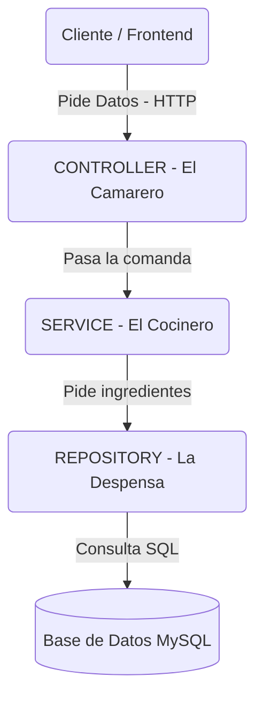

# 🎬 JustFlix Backend - Guía del Estudiante

¡Bienvenido al backend de JustFlix! Este proyecto es el "cerebro" de la aplicación. Si eres nuevo en **Spring Boot** pero ya conoces Java, esta guía está diseñada para explicarte cómo funciona todo sin que te pierdas en los detalles técnicos.

---

## 🧐 ¿Qué es Spring Boot y por qué es diferente a Java "normal"?

En Java tradicional, tú eres responsable de crear los objetos (`new Clase()`) y conectarlos. En Spring, **el Framework hace el trabajo duro por ti**.

### Conceptos Mágicos que verás en el código

1. **Inyección de Dependencias (`@Autowired`)**:
    * *Java Normal*: `private Servicio miServicio = new Servicio();`
    * *Spring*: Tú declaras la variable y le pones `@Autowired`. Spring busca ese objeto en su memoria y te lo "inyecta" automáticamente. ¡No más `new`!
2. **Anotaciones (`@...`)**:
    * Son etiquetas que le pones a las clases/métodos para decirle a Spring qué hacer con ellos.
    * Ejemplo: Al poner `@RestController` en una clase, Spring sabe automáticamente que esa clase debe escuchar peticiones web (HTTP).
3. **Lombok**:
    * Verás mucho `@Data` o `@AllArgsConstructor`. Esto es una librería que escribe por ti los *getters*, *setters* y constructores al compilar. Tu código queda limpio y corto.

---

## 🏗️ Arquitectura: Las 3 Capas

Para mantener el orden, no escribimos todo el código en un solo archivo. Usamos una arquitectura de capas. Imagina un restaurante:



1. **Controller (El Camarero)**: `com.pi.springboot.controller`
    * Su único trabajo es recibir la petición del usuario (frontend), validar que traiga los datos necesarios y devolver la respuesta final. **No toma decisiones de negocio**.
2. **Service (El Cocinero)**: `com.pi.springboot.services`
    * Aquí ocurre la magia. Si hay que calcular algo, transformar datos o aplicar reglas ("un usuario menor de 18 no puede ver X"), se hace aquí.
3. **Repository (La Despensa)**: `com.pi.springboot.repository`
    * Es la capa que habla con la Base de Datos. Gracias a **JPA**, no necesitas escribir SQL (normalmente). Spring te da métodos como `.save()` o `.findById()` "gratis".

---

## 📂 Estructura del Proyecto (Dónde encontrar las cosas)

La ruta base es: `src/main/java/com/pi/springboot/`

| Carpeta | ¿Qué hay dentro? | Nivel de Dificultad |
| :--- | :--- | :--- |
| **`model`** | **Las Tablas de la BD**. Cada clase Java aquí (como `Video.java`) se convierte automáticamente en una tabla en MySQL gracias a la anotación `@Entity`. Si añades un campo `String titulo;`, aparecerá una columna `titulo` en la base de datos. | 🟢 Fácil |
| **`repository`** | **Las Consultas**. Son interfaces. Normalmente están vacías porque heredan de `JpaRepository` que ya trae todo lo básico. Si necesitas una búsqueda especial (ej: "buscar video por categoría"), se define aquí. | 🟢 Fácil |
| **`services`** | **La Lógica**. Aquí verás interfaces (`IAlgoService`) y sus implementaciones (`AlgoServiceImpl`). Es donde pasarás más tiempo programando reglas. | 🟡 Medio |
| **`controller`** | **Los Endpoints**. Aquí defines las URLs (ej: `/api/videos`). Decides si es `GET`, `POST`, `PUT`, o `DELETE`. | 🟡 Medio |
| **`DTO`** | **Objetos de Transporte**. A veces no quieres enviar TODA la información de la base de datos al usuario (por ejemplo, evitar enviar contraseñas). Usamos DTOs ("Data Transfer Objects") para copiar solo los datos necesarios y enviarlos. | 🟡 Medio |
| **`security`** | **Seguridad Avanzada**. Configuración de quién puede entrar y cómo. Aquí está la lógica de JWT y HTTPS. | 🔴 Avanzado |

---

## 🔐 Tecnologías Especiales (JWT y HTTPS)

Este proyecto no es una API insegura cualquiera. Implementa seguridad real.

### 1. JWT (JSON Web Token) - El "Carnet de Identidad"

En lugar de que el usuario envíe usuario/contraseña en cada petición, lo hace una vez (Login). El servidor le devuelve un **Token (JWT)**.

* Es una cadena larga de letras y números.
* El cliente (frontend) debe enviar este token en la cabecera de cada petición futura.
* **En este proyecto**: Usamos criptografía asimétrica. El servidor tiene una **Clave Pública** para verificar que el token es auténtico y no ha sido falsificado.
* *Configuracion*: Mira la propiedad `spring.security.oauth2.resourceserver.jwt.public-key-location`.

### 2. HTTPS y SSL

El servidor está configurado para usar `HTTPS` (candado verde) en lugar de `HTTP`.

* Esto encripta la comunicación para que nadie pueda "espiar" los datos en la red.
* Requiere un certificado digital (`keystore/justflix.p12`).
* **Importante**: Si intentas conectar con `http://localhost:8081`, fallará. Debes usar `https://`.

---

## 👩‍💻 Guía: Cómo crear una nueva funcionalidad

Imagina que quieres añadir la gestión de **"Directores"** de cine.

**Paso 1: El Modelo (Model)**
Crea `model/Director.java`.

```java
@Entity // Convierte esto en tabla
@Data   // Crea getters/setters auto
public class Director {
    @Id
    @GeneratedValue(strategy = GenerationType.IDENTITY)
    private Long id;
    private String nombre;
}
```

**Paso 2: El Repositorio (Repository)**
Crea `repository/DirectorRepository.java`.

```java
// ¡Ya tienes acceso a guardar, borrar y buscar directores!
public interface DirectorRepository extends JpaRepository<Director, Long> {
}
```

**Paso 3: El Servicio (Service)**
Define la lógica en `services/DirectorServiceImpl.java`.

```java
@Service
public class DirectorServiceImpl implements DirectorService {
    @Autowired // Spring, dame el repositorio, por favor
    private DirectorRepository repo;

    public List<Director> obtenerTodos() {
        return repo.findAll();
    }
}
```

**Paso 4: El Controlador (Controller)**
Exponlo al mundo en `controller/DirectorController.java`.

```java
@RestController
@RequestMapping("/api/directores")
public class DirectorController {
    @Autowired
    private DirectorService service;

    @GetMapping
    public List<Director> listar() {
        return service.obtenerTodos();
    }
}
```

¡Y listo! Al arrancar la aplicación, tendrás una nueva tabla y una nueva URL funcionando.

---

## 🚀 Ejecución del Proyecto

1. **Base de Datos**: Asegúrate de tener MySQL corriendo y una base llamada `Justflix`.
2. **Arrancar**:
   * Si usas VS Code / IntelliJ: Busca el archivo `SpringbootApplication.java` y dale al botón "Play".
   * Desde terminal: `./mvnw spring-boot:run`
3. **Probando**:
   * Recuerda usar **HTTPS**.
   * Necesitarás un Token JWT válido para muchas peticiones si la seguridad está activa.
